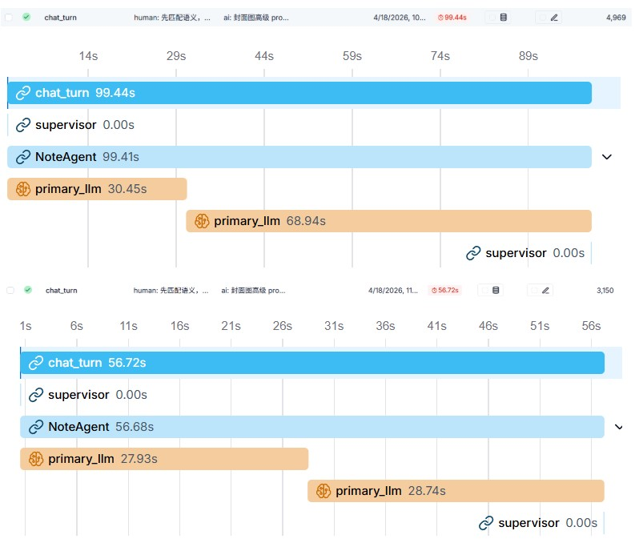

# Paper2Content

> From paper reading to publish-ready content.

## 项目效果演示

- 小红书实际效果展示：[`Paper2Content Demo`](https://www.xiaohongshu.com/user/profile/66c61447000000001d022d71?xsec_token=ABPFxo8ykoitViGyQmpeYXzn6WmSGoKOnquRuc0f-R3yU%3D&xsec_source=pc_search)

Paper2Content 是一个基于 LangGraph、FAISS 与 MCP 构建的论文学习与内容生产系统。它不只是在做 “Chat with PDF”，而是把论文解析、检索问答、会话沉淀、图文草稿生成、封面生成、风格迁移和小红书发布串成了一条完整工作流。

当前项目适合这几类场景：

- 读论文时，希望能持续追问、对比多篇文献并保留上下文。
- 想把论文 insight 整理成适合发布的小红书图文。
- 想把问答过程沉淀为可复用的会话资产，而不是一次性聊天记录。

## 核心能力

- PDF 原生入库：使用 `PyMuPDF4LLM` 解析论文，并做父子分块后写入 FAISS。
- 多 Agent 问答：`Supervisor` 负责任务路由，协调 `ResearchAgent`、`NoteAgent`、`GeneralAgent`。
- 长期记忆：对话可压缩并写入会话级语义记忆，用于后续问答时的上下文补充。
- 图文生产：从会话历史生成小红书笔记草稿、封面提示词和发布参数。
- 发布链路：支持小红书 MCP 发布，以及封面风格迁移 MCP。

## 项目简介

Paper2Content 解决的是一条经常断裂的链路：

`读论文 -> 做问答 -> 形成理解 -> 整理为内容 -> 发布 -> 复盘`

这里的“复盘”不是把历史对话简单压缩后回注。更准确地说：

- 会话内的历史内容会被压缩成长期记忆，帮助后续继续问答。
- 内容产出后的复盘，可以回到小红书发布侧查看成稿表现，再继续迭代标题、正文、封面和发布策略。

也就是说，系统既支持“问答连续性”，也支持“内容发布后的结果复看”。

## 项目结构

```text
paper_assitant/
├── main.py                         # 应用入口，启动 Gradio 并组装 MultiAgentApp
├── config.py                       # 主模型、快速模型、Embedding、LangSmith 配置
├── requirements.txt                # Python 依赖
├── .env.example                    # 环境变量模板
├── document/
│   ├── loader.py                   # PDF 解析与入库
│   ├── chunking.py                 # 父子分块
│   ├── registry.py                 # documents.json 元数据管理
│   └── source_excerpt.py           # 封面素材抽取
├── graph/
│   ├── builder.py                  # LangGraph 主图构建
│   └── supervisor.py               # Supervisor 路由与任务编排
├── agents/
│   ├── research.py                 # 文档检索问答
│   ├── note_agent.py               # 笔记整理与发布相关路由
│   ├── general.py                  # 通用问答
│   └── base.py                     # ReAct Agent 基础封装
├── memory/
│   ├── store.py                    # 记忆读写与向量存储初始化
│   └── compression.py              # 对话压缩
├── session/
│   └── manager.py                  # 会话生命周期管理
├── ui/
│   └── gradio_app.py               # Gradio 界面
├── xhs/
│   ├── note_service.py             # 小红书图文草稿生成与发布编排
│   ├── image_service.py            # 封面图生成
│   ├── style_transfer_service.py   # 风格迁移 MCP 调用
│   └── publish_service.py          # 小红书 MCP 发布调用
├── eval/                           # RAG 评测脚本
├── docs/                           # 补充文档
├── vectorstores/                   # FAISS 持久化目录
├── documents.json                  # 文档注册表
├── sessions.json                   # 会话元数据
└── sessions.db                     # LangGraph SQLite checkpoint
```

## 系统架构

### 1. 整体链路

```text
用户
  ↓
Gradio UI
  ↓
MultiAgentApp
  ├── 论文问答主链
  │   └── Supervisor -> ResearchAgent / NoteAgent / GeneralAgent
  └── 内容生产侧链
      └── XHSNoteService -> 封面生成 -> 风格迁移 -> MCP 发布
```

### 2. 论文问答主链

```text
用户提问
  -> 会话历史压缩
  -> 长期记忆检索
  -> Supervisor 路由
     -> ResearchAgent：检索论文、抽取证据、组织回答
     -> NoteAgent：整理笔记、生成图文草稿、处理发布相关意图
     -> GeneralAgent：通用解释、非检索型回答
  -> 返回答案
```

这条链路负责保证论文问答能力本身的稳定性。对复杂问题，`Supervisor` 会拆步骤，再由不同 Agent 分工执行并汇总结果。

### 3. 内容生产侧链

```text
session chat history
  -> XHSNoteService
  -> XHSNoteDraft / XHSNoteArtifact
  -> Image Prompt
  -> DashScope Image Generation
  -> Style Transfer MCP
  -> XHS MCP publish_content
```

这条侧链消费的是会话中已经沉淀下来的内容，不直接干扰论文问答主链。这样可以把“回答问题”和“生成可发布内容”拆开，方便单独迭代。

### 4. 状态与持久化

- `sessions.db`：保存 LangGraph 会话状态与消息 checkpoint。
- `sessions.json`：保存会话元数据，如标题、创建时间。
- `documents.json`：保存论文标题、摘要、分块数量等元信息。
- `vectorstores/pdf_knowledge/`：论文知识库向量索引。
- `vectorstores/user_semantic_memory/`：长期记忆向量索引。
- `result/`：评测、生成图片等输出目录。

## 评估结果

### 1. RAG 检索评测

当前项目保留了统一评测入口：

```powershell
python eval/eval.py
```

已对 3 组检索方案做过对比：

| Variant | Context Precision | Context Recall | Retrieval F1 | Answer Correctness | Faithfulness |
| --- | ---: | ---: | ---: | ---: | ---: |
| `01_fixed_chunk_embedding3` | 0.9600 | 0.8633 | 0.8760 | 0.7251 | 0.9293 |
| `02_parent_child_lexical` | 0.3800 | 0.3933 | 0.2347 | 0.4006 | 0.8492 |
| `03_parent_child_embedding3` | 0.9400 | 0.9250 | 0.8947 | 0.7537 | 0.9519 |

当前最佳方案是 `03_parent_child_embedding3`，也就是“父子分块 + Embedding-3”。

### 2. LangSmith 运行观测优化

在最新一轮 LangSmith 观测中，项目主链路的响应时间和 Token 消耗都有明显下降：

| 指标 | 优化前 | 优化后 | 变化 |
| --- | ---: | ---: | ---: |
| 响应时间 | 99.44 s | 56.72 s | 降低约 43.0% |
| Token 用量 | 4969 | 3150 | 降低约 36.6% |

这意味着当前版本在保持核心能力的同时：

- 平均响应更快，用户等待时间明显下降。
- 推理成本更低，长链路问答与内容生产更可持续。

LangSmith 截图如下：



## 快速开始

### 1. 环境要求

- Python `3.10+`
- 至少一组可用的 GLM / 智谱 API Key
- 可选：DashScope 图片生成能力
- 可选：小红书 MCP 服务
- 可选：风格迁移 MCP 服务

### 2. 安装依赖

```powershell
git clone https://github.com/jhGao2002/myPaperAssistant.git
cd myPaperAssistant
python -m venv .venv
.venv\Scripts\Activate.ps1
pip install -r requirements.txt
Copy-Item .env.example .env
```

### 3. 配置环境变量

至少需要配置这些核心参数：

```env
LLM_MODEL_ID=glm-5
LLM_API_KEY=your_zhipu_api_key_here
LLM_BASE_URL=https://open.bigmodel.cn/api/paas/v4/

ZHIPU_API_KEY=your_zhipu_api_key_here
ZHIPU_URL=https://open.bigmodel.cn/api/paas/v4/

FAISS_INDEX_ROOT=vectorstores
FAISS_USE_GPU=0
FAISS_GPU_DEVICE=0

GRADIO_SHARE=0
GRADIO_SERVER_NAME=127.0.0.1
GRADIO_SERVER_PORT=7861
```

如果你要跑完整图文生产链路，再补充这些可选配置：

```env
DASHSCOPE_API_KEY=your_dashscope_api_key
DASHSCOPE_IMAGE_MODEL=z-image-turbo
XHS_MCP_ENDPOINT=http://localhost:18060/mcp
STYLE_TRANSFER_MCP_ENDPOINT=http://127.0.0.1:1234/mcp
```

如果你要接 LangSmith 观测：

```env
LANGSMITH_TRACING=1
LANGSMITH_API_KEY=your_langsmith_api_key
LANGSMITH_PROJECT=paper2content
```

### 4. 外部 MCP 服务

README 中提到的两个 MCP 服务来源如下：

- 小红书 MCP 服务：[`xpzouying/xiaohongshu-mcp`](https://github.com/xpzouying/xiaohongshu-mcp)
- 风格迁移 MCP 服务：[`jhGao2002/ADServer`](https://github.com/jhGao2002/ADServer)

如果这两个服务没有启动，论文问答功能仍然可以使用，但“小红书发布”和“风格迁移”相关能力会不可用。

### 5. 启动应用

```powershell
python main.py
```

默认访问地址：

```text
http://127.0.0.1:7861
```

### 6. 典型使用路径

1. 在 Gradio 页面中新建会话。
2. 上传 PDF，完成文档入库。
3. 勾选当前会话要参与问答的论文。
4. 基于论文进行问答、对比和总结。
5. 让系统整理成小红书图文草稿。
6. 按需生成封面、做风格迁移并发布。

## 数据与产物

- `documents.json`：论文注册表，记录标题、摘要、分块数量等。
- `sessions.json`：会话列表与标题。
- `sessions.db`：LangGraph 会话状态数据库。
- `vectorstores/`：FAISS 索引及明文 metadata。
- `result/eval_runs/`：RAG 评测结果。
- `result/xhs_note_images/`：生成的小红书封面图。

如果你只是想重建索引或清空历史，可以优先备份这些文件后再删除，而不是直接清仓整个仓库。

## License

本项目采用 [MIT License](LICENSE)。

选择 MIT 的原因很简单：它是最常见、最易理解、协作成本最低的开源协议之一，适合当前这种以学习、实验和二次开发为主的项目形态。
