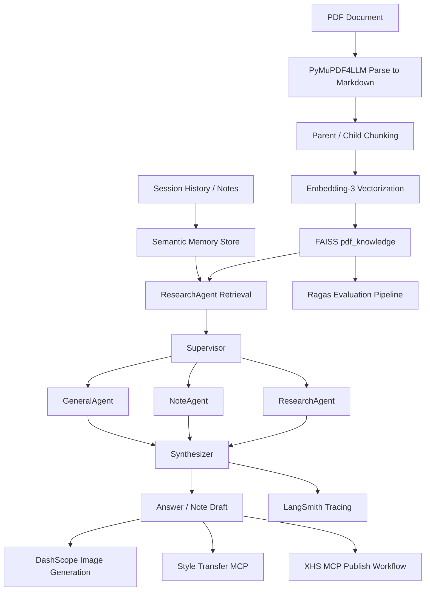

<h1 align="center">Paper2Content</h1>

<p align="center">
  <strong>From Paper Reading to Publish-Ready Content.</strong>
</p>

<p align="center">
  一个基于 LangGraph、FAISS 与 MCP 构建的智能文献学习与内容生产系统。
</p>

<p align="center">
  
  
  
  
  
  
</p>

> Paper2Content 并不是一个停留在“Chat with PDF”的 Demo，而是一个把 **文献学习、知识沉淀、内容整理、封面生成、风格迁移与发布工作流** 串成完整闭环的 Agentic System。项目支持长文本解析、历史记忆回溯、多模态图文生成及跨平台自动化分发，形成“文献学习-内容输出-知识复盘”的完整学习闭环。

---


## Key Features

- 🧠 **多智能体协同编排**：以 `Supervisor + ResearchAgent + NoteAgent + GeneralAgent + Synthesizer` 组成主流程，在问答、检索、内容生成与总结之间动态路由。
- 📄 **面向长文献的双层切块检索**：使用 `PyMuPDF4LLM` 将 PDF 转为 Markdown，再执行 `parent-child chunking`，子块召回、父块回填，兼顾召回率与上下文完整性。
- 🔍 **语义检索与记忆融合**：本地 `FAISS` 同时维护文献知识库与用户语义记忆，问答时将会话历史压缩、召回、重排后注入上下文，提升多轮交互稳定性。
- ✍️ **从学习到内容创作的生产链路**：基于会话历史与记忆笔记自动生成小红书草稿，支持封面提示词生成、DashScope 出图、MCP 风格迁移与发布准备。
- 📊 **自带评测与复盘能力**：仓库内置 `Ragas` 评测脚本与 `LangSmith` tracing 配置，可对不同检索策略进行指标、耗时与 Token 成本对比，形成可复现的优化闭环。

---

## Architecture

核心数据流如下:

`PDF -> Markdown 解析 -> Parent/Child Chunking -> Embedding-3 向量化 -> FAISS 索引 -> Multi-Query Retrieval -> Parent Context 回填 -> Supervisor 路由 -> Agent 生成/总结 -> 内容草稿/封面/发布 -> LangSmith & Ragas 复盘`



### Core Modules

```text
paper_assitant/
|-- main.py                      # 应用入口，组合 Gradio UI 与 MultiAgentApp
|-- config.py                    # LLM / Embedding / LangSmith 配置
|-- document/                    # PDF 解析、切块、文献注册
|-- graph/                       # LangGraph 工作流与 Supervisor 路由
|-- agents/                      # Research / Note / General Agents
|-- memory/                      # 本地语义记忆与会话上下文压缩
|-- session/                     # sessions.json + sessions.db 管理
|-- xhs/                         # 小红书草稿、出图、风格迁移、发布链路
|-- style/                       # 风格图管理
|-- ui/                          # Gradio 界面
|-- eval/                        # Ragas 评测脚本与实验配置
|-- docs/assets/                 # README 资产
`-- vectorstores/                # FAISS 索引落盘目录
```

---

## Benchmarks / Performance

项目内置的 `eval/eval.py` 对 3 种检索方案进行了统一评测，关键指标如下:

| Variant | Context Recall | Retrieval F1 | Answer Correctness | Faithfulness |
| --- | ---: | ---: | ---: | ---: |
| `01_fixed_chunk_embedding3` | 0.8633 | 0.8760 | 0.7251 | 0.9293 |
| `02_parent_child_lexical` | 0.3933 | 0.2347 | 0.4006 | 0.8492 |
| `03_parent_child_embedding3` | **0.9250** | **0.8947** | **0.7537** | **0.9519** |

**结论非常明确：当前仓库中表现最优的方案是 `03_parent_child_embedding3`。**

- **Context Recall** 从 `0.8633` 提升到 `0.9250`
- **Retrieval F1** 从 `0.8760` 提升到 `0.8947`
- **Answer Correctness** 从 `0.7251` 提升到 `0.7537`
- **Faithfulness** 提升到 `0.9519`

仓库现有 LangSmith 记录还给出了链路优化前后的运行收益:

| Metric | Before | After | Delta |
| --- | ---: | ---: | ---: |
| Runtime | 99.44 s | 56.72 s | **-43.0%** |
| Total Tokens | 4969 | 3150 | **-36.6%** |


---

## Quick Start

### 1. Prerequisites

- Python `3.10+`
- 可用的智谱模型与向量接口
- 可选的 DashScope 图像生成能力
- 可选的小红书 MCP 服务
- 可选的风格迁移 MCP 服务

### 2. Clone & Install

```powershell
git clone https://github.com/jhGao2002/myPaperAssistant.git
cd myPaperAssistant
python -m venv .venv
.venv\Scripts\Activate.ps1
pip install -r requirements.txt
Copy-Item .env.example .env
```

### 3. Configure Environment

基础模型与向量检索配置:

```env
LLM_MODEL_ID=glm-5
LLM_API_KEY=your_zhipu_api_key_here
LLM_BASE_URL=https://open.bigmodel.cn/api/paas/v4/

ZHIPU_API_KEY=your_zhipu_api_key_here
ZHIPU_URL=https://open.bigmodel.cn/api/paas/v4/
EMBED_BATCH_SIZE=64

FAISS_INDEX_ROOT=vectorstores
FAISS_USE_GPU=0
FAISS_GPU_DEVICE=0
```

可选的内容生产与发布配置:

```env
DASHSCOPE_API_KEY=your_dashscope_api_key
DASHSCOPE_IMAGE_MODEL=z-image-turbo
XHS_MCP_ENDPOINT=http://localhost:18060/mcp
STYLE_TRANSFER_MCP_ENDPOINT=http://127.0.0.1:1234/mcp
```

可选的可观测性配置:

```env
LANGSMITH_TRACING=1
LANGSMITH_API_KEY=your_langsmith_api_key
LANGSMITH_PROJECT=paper2content
LANGSMITH_ENDPOINT=https://api.smith.langchain.com
```

### 4. Run the App

```powershell
python main.py
```

默认访问地址:

```text
http://127.0.0.1:7861
```

### 5. Typical Workflow

1. 在 Gradio 界面上传论文 PDF。
2. 系统执行 Markdown 解析、双层切块与向量索引。
3. 围绕论文进行多轮提问，交由 `Supervisor` 路由到不同 Agent。
4. 将有效洞察沉淀为会话记忆与笔记候选。
5. 触发内容生成链路，生成小红书草稿与封面图。
6. 按需接入风格迁移与 MCP 发布流程。

### 6. Run Evaluation

```powershell
python eval/eval.py
```

如果需要重新生成评测集:

```powershell
python eval/eval.py --regenerate-dataset
```

---

## License

本项目采用 [MIT License](LICENSE) 开源协议。
