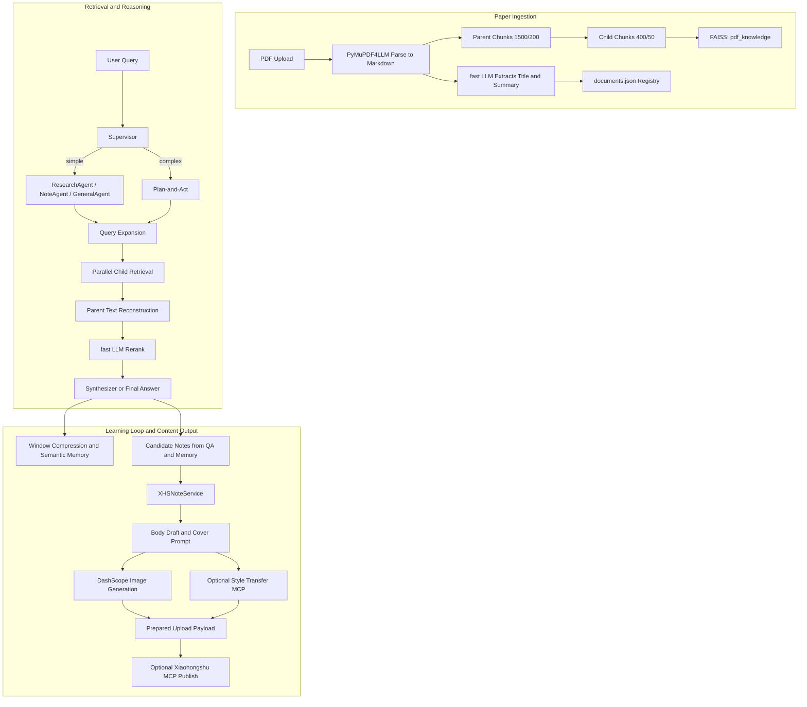

<h1 align="center">Paper2Content</h1>

<p align="center">
  <strong>From Paper Reading to Publish-Ready Content.</strong>
</p>

<p align="center">
  一个基于 LangGraph、FAISS 与 MCP 构建的智能文献学习与内容生产系统。
</p>

<p align="center">
  
  
  
  
  
  
</p>

> Paper2Content 并不是一个停留在“Chat with PDF”的 Demo，而是一个把 **文献学习、知识沉淀、内容整理、封面生成、风格迁移与发布工作流** 串成完整闭环的 Agentic System。它面向的核心痛点，不只是“怎么回答论文问题”，而是“如何把长论文理解、跨文献对比、知识复盘和内容创作放进同一条工程化链路里”。

---

## 项目简介 (Overview)

Paper2Content 解决的是研究者、AI 工程师和技术内容创作者在真实工作流里的断层问题: 论文能读，但难以持续检索；问答能做，但难以沉淀为结构化知识；内容能产出，但很难直接回到可发布的图文资产。当前实现以 `PyMuPDF4LLM -> Parent/Child Chunking -> FAISS -> LangGraph Supervisor -> Note Workflow -> MCP Publish` 为主干，把 PDF 论文解析为可检索知识库，把多轮对话压缩为会话级长期记忆，再把关键 insight 组织成可修改、可生成封面、可发布的小红书图文内容。

系统的价值不在单点能力，而在于它把“文献学习 -> 内容输出 -> 知识复盘”做成了一个可反复执行的闭环:

- 学习阶段，支持多论文检索、复杂问题拆解和基于证据的回答。
- 输出阶段，能从问答记录和会话笔记中提炼可发布的正文草稿与封面 prompt。
- 复盘阶段，系统会把对话压缩为长期记忆，并在后续问答中按 `user_id + session_id` 语义回注。

---

## 核心特性 (Key Features)

- 📄 **论文原生入库链路**: 使用 `PyMuPDF4LLM` 将 PDF 转为 Markdown，并按父子块策略切分为 `1500/200` 父块与 `400/50` 子块；文档入库后自动抽取标题、摘要与分块数，持久化到 `documents.json`。
- 🧭 **Supervisor 驱动的 Plan-and-Act 编排**: `Supervisor` 会判断问题是简单单跳检索还是复杂多步任务；复杂问题自动生成 plan，分派给 `ResearchAgent / NoteAgent / GeneralAgent`，最后由 `Synthesizer` 汇总多步结果。
- 🔎 **面向长文献的检索增强链路**: `ResearchAgent` 先做 query expansion，再并行召回子块，通过 `parent_id + parent_text` 回填父块上下文，最后交给 fast LLM 做 rerank，减少长论文问答中的碎片化回答。
- 🧠 **会话级长期记忆与窗口压缩**: 当消息窗口超限时，系统会自动压缩早期对话并写入语义记忆库；后续问答会按会话粒度检索事实与笔记，实现真正可复盘的学习过程。
- ✍️ **从论文理解到内容发布的闭环**: `NoteAgent + XHSNoteService` 支持从问答候选筛选、正文草稿生成、封面高级 prompt 构建，到封面图生成、风格迁移与 MCP 发布，把论文 insight 直接变成图文内容资产。

---

## 系统架构 (Architecture)

Paper2Content 当前的核心数据流转如下:

1. **文献解析与入库**: 上传 PDF 后，系统使用 `PyMuPDF4LLM` 解析全文，并按父子块策略切分；子块向量写入 `pdf_knowledge`，文档元数据登记到 `documents.json`。
2. **检索增强与多 Agent 推理**: 用户问题进入 `Supervisor`；简单问题直接路由到专家 Agent，复杂问题进入 Plan-and-Act；`ResearchAgent` 负责扩展查询、并行召回、父块回填和 rerank。
3. **会话记忆与状态持久化**: 聊天记录通过 `langgraph-checkpoint-sqlite` 持久化到 `sessions.db`，会话元数据保存在 `sessions.json`，长期语义记忆保存在 `user_semantic_memory`。
4. **内容生产与发布**: 当用户进入图文流程后，系统会从问答和笔记中提炼候选素材，生成图文草稿、封面 prompt、图片资源，并可选接入风格迁移 MCP 和小红书发布 MCP。



---

## 评测与表现 (Benchmarks / Performance)

> 评测时间: **2026-04-16**  
> 评测样本数: **50**  
> 评测入口: `python eval/eval.py`  
> 结果来源: `eval/README.md` 末尾记录与 `result/eval_runs/` 输出

当前评测管线对 3 组检索方案进行了统一对比:

- `01_fixed_chunk_embedding3`: 固定块切分 + `Embedding-3`
- `02_parent_child_lexical`: 父子块切分 + 词法哈希 embedding
- `03_parent_child_embedding3`: 父子块切分 + `Embedding-3`

| Variant | Context Precision | Context Recall | Retrieval F1 | Answer Correctness | Faithfulness |
| --- | ---: | ---: | ---: | ---: | ---: |
| `01_fixed_chunk_embedding3` | **0.9600** | 0.8633 | 0.8760 | 0.7251 | 0.9293 |
| `02_parent_child_lexical` | 0.3800 | 0.3933 | 0.2347 | 0.4006 | 0.8492 |
| `03_parent_child_embedding3` | 0.9400 | **0.9250** | **0.8947** | **0.7537** | **0.9519** |

核心结论很明确:

- **当前最佳方案是 `03_parent_child_embedding3`**，在保持高精度的同时，把 `Context Recall` 提升到 `0.9250`，更适合长论文检索与复杂问答。
- 相比固定块基线，父子块 + `Embedding-3` 带来了更平衡的整体收益: `Recall +6.17 pts`、`Retrieval F1 +1.87 pts`、`Answer Correctness +2.86 pts`、`Faithfulness +2.26 pts`。
- `02_parent_child_lexical` 的明显退化说明，**Chunking 策略的收益必须与足够强的向量表示能力配套**，这也是当前 RAG 方案设计中的关键工程洞察。

此外，评测流水线还会同步记录:

- 每个变体的回答生成 token 用量
- Ragas 判分阶段 token 用量
- 中间答案、指标 CSV 与 `latest` 快照目录

---

## 快速开始 (Quick Start)

### 1. 前置依赖

- Python `3.10+`
- 至少一组可用的 GLM / 智谱 API Key
- 可选: DashScope 图片生成能力，用于封面图生成
- 可选: 小红书 MCP 服务，用于自动发布图文笔记
- 可选: 风格迁移 MCP 服务，用于封面风格迁移

### 2. 克隆并安装依赖

```powershell
git clone https://github.com/jhGao2002/myPaperAssistant.git
cd myPaperAssistant
python -m venv .venv
.venv\Scripts\Activate.ps1
pip install -r requirements.txt
Copy-Item .env.example .env
```

### 3. 配置环境变量

至少需要补齐以下核心配置:

```env
LLM_MODEL_ID=glm-5
LLM_API_KEY=your_zhipu_api_key_here
LLM_BASE_URL=https://open.bigmodel.cn/api/paas/v4/

ZHIPU_API_KEY=your_zhipu_api_key_here
ZHIPU_URL=https://open.bigmodel.cn/api/paas/v4/

FAISS_INDEX_ROOT=vectorstores
FAISS_USE_GPU=0
FAISS_GPU_DEVICE=0
GRADIO_SHARE=0
```

如果你要走完整的图文生产链路，再补齐可选配置:

```env
DASHSCOPE_API_KEY=your_dashscope_api_key
XHS_MCP_ENDPOINT=http://localhost:18060/mcp
STYLE_TRANSFER_MCP_ENDPOINT=http://127.0.0.1:1234/mcp
```

### 4. 启动主应用

```powershell
python main.py
```

默认访问地址:

```text
http://127.0.0.1:7861
```

### 5. 典型使用路径

1. 在 Gradio 界面中上传 PDF 并完成入库。
2. 为当前会话勾选需要参与问答的文档。
3. 进行单文献问答或跨文献对比分析。
4. 让系统把当前问答整理成笔记或“小红书图文笔记”。
5. 按需生成封面图、做风格迁移，并接入 MCP 发布。

### 6. 运行评测

完整评测:

```powershell
python eval/eval.py
```

快速 smoke test:

```powershell
python eval/eval.py --beta
```

评测结果默认会输出到:

```text
result/eval_runs/
```

---

## 路线图 (Roadmap)

- [ ] 增强检索层，继续探索更稳定的混合检索、rerank 与引用级 grounding。
- [ ] 为内容生产链路补充更强的模板控制与可编辑工作流，提升论文到图文的可控性。
- [ ] 增加更规范的工程化交付能力，例如 Docker 化部署、自动化测试与 CI。
- [ ] 扩展评测集与任务类型，把单轮 QA、跨论文比较、内容生成质量纳入统一评估。

---

## 致谢与协议 (License)

Paper2Content 基于以下优秀开源生态构建: `LangGraph`、`LangChain`、`FAISS`、`PyMuPDF4LLM`、`Gradio`、`Ragas` 与 `MCP`。

当前仓库 **尚未附带显式的 LICENSE 文件**。如果后续准备以标准开源项目方式长期对外发布，建议补充明确协议，例如 `MIT` 或 `Apache-2.0`，以便社区协作与二次分发。
